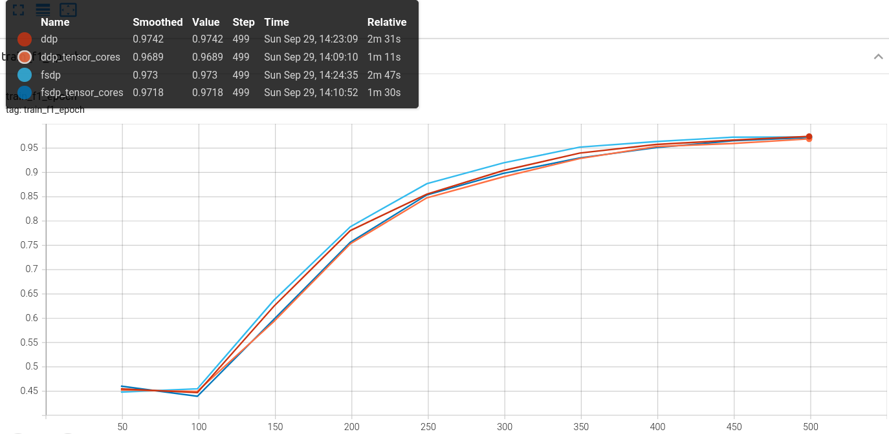
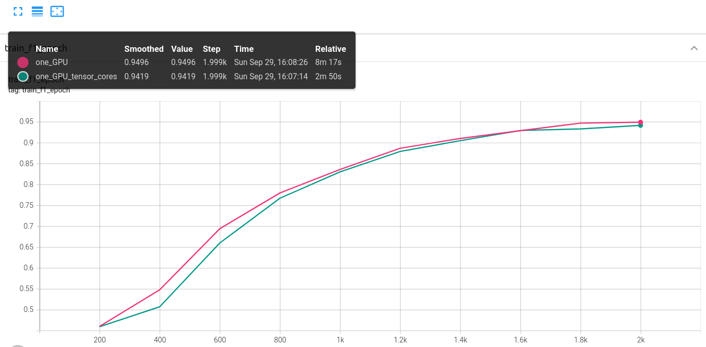

**SLURM Script** 
TO launch a training sbatch can be used with the following programs:  
- launch_train_auto.sh to launch a training on a single GPU
- launch_train_ddp.sh to launch a training on 2 devices with 2 GPUs each. The strategy used is DDP.
- launch_train_fsdp.sh to launch a training on 2 devices with 2 GPUs each. The strategy used is FSDP.

The settings (number of epochs, use of tensor cores) of each training can be can changed in their respective files:
- trainauto.sh  
- trainddp.sh  
- trainfsdp.sh  

**Create a dataset**  
The dataset I used is the dev-v2 dataset. It is a json file. I didn't know how to read this file so I used a code from kaggle:  
https://www.kaggle.com/code/sanjay11100/squad-stanford-q-a-json-to-pandas-dataframe  
This dataset can't  directly be used for training. It must be tokenized first. 
I didn't know how to do it so I have used a code from CHATGPT that I have modified.  
To simplify the dataset, only the first 2000 rows and the first answer of each questions have been kept.  
The split ration between the train and vaidation dataset is 0,8/0,2.  
  
The model chosen for this task is the pre-trained bert base cased.  
The optimizer is AdamW which is similar the the usual Adam optimizer but with weight decay. It seems that this kind of optimizer is better for transformer models.  
The learning rate at the beginning of the training is 5e-5 which is the usual learning rate for transformers.  

**Loss and Metrics**  
The default loss for this model is the binary crossentropy loss.  
To have something else from the loss to display on tensorboard I used the f1_score and a exact_match score.  
The f1_score wasn't imported from scikit_learn because to use it, the data must be in numpy array and not tensors. However, to get numpy arrays it seems that it is necessary to transfer my results from the GPU to the CPU.  

**Tensorboard logs**  
In model.py, the model is defined the logs are created with the following functions.  

```python
def on_train_epoch_end(self):  
    avg_loss = torch.stack(self.train_losses).mean()  
    avg_f1 = torch.stack(self.train_f1s).mean()  
  
    # Log average loss and metrics  
    self.log('train_loss_epoch', avg_loss, on_epoch=True, prog_bar=True, sync_dist=True)  
    self.log('train_f1_epoch', avg_f1, on_epoch=True, prog_bar=True, sync_dist=True)  
  
    self.train_losses.clear()  
    self.train_f1s.clear()  
  
def on_validation_epoch_end(self):  
    avg_val_loss = torch.stack(self.val_losses).mean()  
    avg_val_f1 = torch.stack(self.val_f1s).mean()  

    # Log average validation loss and metrics
    self.log('val_loss_epoch', avg_val_loss, on_epoch=True, prog_bar=True, sync_dist=True)  
    self.log('val_f1_epoch', avg_val_f1, on_epoch=True, prog_bar=True, sync_dist=True)  
  
    self.val_losses.clear()  
    self.val_f1s.clear()  
```  
However, for some reasons the logs created use the number of steps instead of the number of epochs.

**Training**  
For some reasons I couldn't lauch a training from a notebook. The code has been adapted to .py files instead.  
The training part is easy, after the model is created I use a Trainer from pytorch lightning.  

```python
# Create the model  
model = get_model(model, optim)  

# Model checkpoint callback for saving checkpoints every 2 epochs  
checkpoint_callback = ModelCheckpoint(  
    every_n_epochs=2,  # Save every 2 epochs  
    filename='checkpoint-{epoch:02d}-{val_loss:.4f}',  
    save_weights_only=True  # Save only model weights  
)  

# Tensorboard logger  
tensorboard_logger = TensorBoardLogger("logs")  

# Create the trainer  
trainer = pl.Trainer(
    max_epochs=epochs,                       # Number of epochs  
    callbacks=[checkpoint_callback],         # Model checkpoint callback  
    logger=tensorboard_logger,               # TensorBoard logger  
    strategy=strategy,                       # Distributed data parallel strategy (ddp)  
    devices=devices,                         # Number of GPUs per node  
    num_nodes=num_nodes                      # Number of nodes  
)  

# Start training  
trainer.fit(model, train_dataloader, validation_dataloader)  

# The tensor cores of A100 are enabled or not with:
if use_tensor_cores:
    # Use the best of A100
    torch.set_float32_matmul_precision('high')  # High for best performance (could test with medium)
```

**Results**  
I have trained for 10 epochs.  
The results at the end of the training are:  
- On a single GPU: 8m17s = 497s with an average time of 49s per epochs for the training step, which is similar to the time obtained with the BASELINE implementation.  
- On 4 GPUs with the DDP strategy: 2m31s = 151s with an average time of 14s per epochs for the training step.  
- On 4 GPUs with the FSDP stategy: 2m47s = 167s with an average time of 15s per epochs for the training step.

It is possible to improve the training time even more by using the tensor cores of A100s:  
- On a single GPU: 2m50s = 170s with an average time of 16s per epochs for the training step.  
- On 4 GPUs with the DDP strategy: 1m11s = 71s  with an average time of 5s per epochs for the training step.    
- On 4 GPUs with the FSDP stategy: 1m30s = 90s  with an average time of 7s per epochs for the training step.  
    
   
